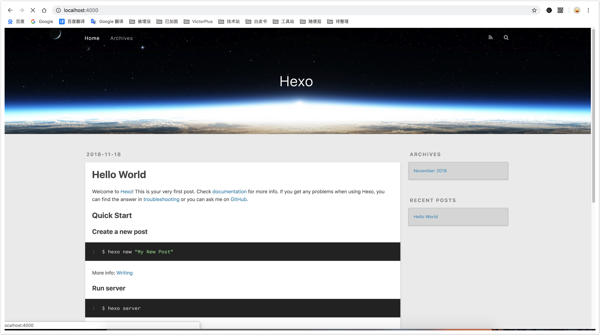
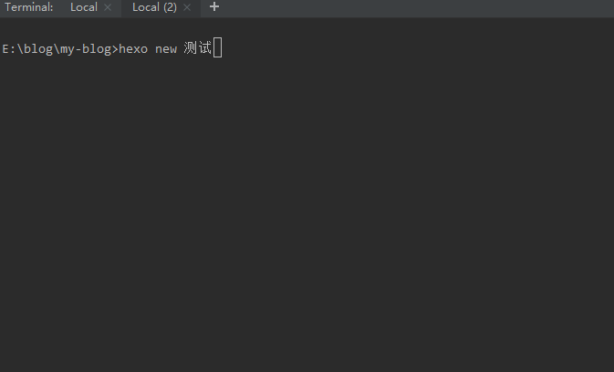
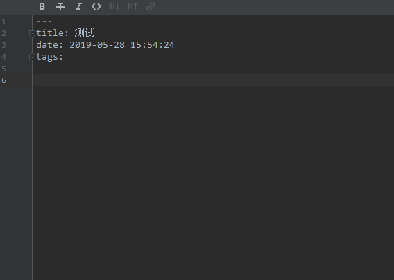

使用Hexo写博文
安装Hexo
使用Hexo的前提是你已经安装了Node.js！
选择一个文件夹作为博客项目，比如blog
安装Hexo

$ npm install hexo-cli -g
$ hexo init blog
$ cd blog
$ npm install
$ hexo s

文件及目录如下：
node_modules  npm 文件缓存目录  
scaffolds     文夹件下存放的是文章、页面模版  
scource       文夹件下存放的是我们的资源文件  
themes        文件下存放的是我们的主题文件  
.gitignore    git 忽略文件，设置提交文件时，哪些文件不提交  
_config.yml   站点配置文件  
package.json  站点版本，站点依赖文件  
yarn.lock     yarn.lock 文件由 Yarn 自动创建，并且完全通过 Yarn 进行操作。 

打开默认http://localhost:4000/就可以访问博客了。
启动后如图所示：

编写博文
使用hexo new <title>命令就可以开始编写一篇博文，如下图所示：

hexo会自动帮我们创建一个以标题开头的md文件，进入进行编辑，如下图：

运行hexo g进行博文生成，如下图：

运行hexo s查看博文，如下图：

这样一篇文章就写好了！

将博文发布到Github
要将博文发布到Github上首先需要在blog文件夹下执行npm install hexo-deployer-git 安装一个Git插件，然后才能进行发布。

然后在自己的Github上创建一个代码仓库，如图：

在我们的blog文件夹使用命令行执行新仓库提示的初始化命令，如下图：

然后在当前仓库创建一个dev分支存放当前代码，使用master分支存放通过hexo g生成的博文内容，如下图：

配置当前目录下的__config.yml使用hexo的部署策略将已经生成好的博文发布到该仓库的master分支，如下图：

执行hexo d 命令将博文进行发布，如下图：

可以看到master已经变更为更为简洁的博文结构，下面我们进行Github pages设置，让我们的博客能够被访问，如下图：

点击右上角Settings：

拖到底部Github pages节点，选择分支并保存，如下图：

从上图我们能看到我们已经得到一个Github域名，稍等几分钟我们便可以使用这个域名进行博客访问。

访问https://hitime-wiki.github.io/my-blog/

现在看到网站样式是错乱的，原因是当前域名带了二级目录导致，如果我们使用该域名的话可以修改hexo的根目录来解决这个问题，也可以使用自定义域名来解决这个问题。我们今天先修改hexo的根目录指定来解决样式文件加载问题，编辑blog目录下__config.yml如下图：

编辑保存后重新使用hexo g生成博文结构，然后使用hexo d发布博文，稍等一两分钟后刷新https://hitime-wiki.github.io/my-blog/就能看见页面正常了，如下图：

